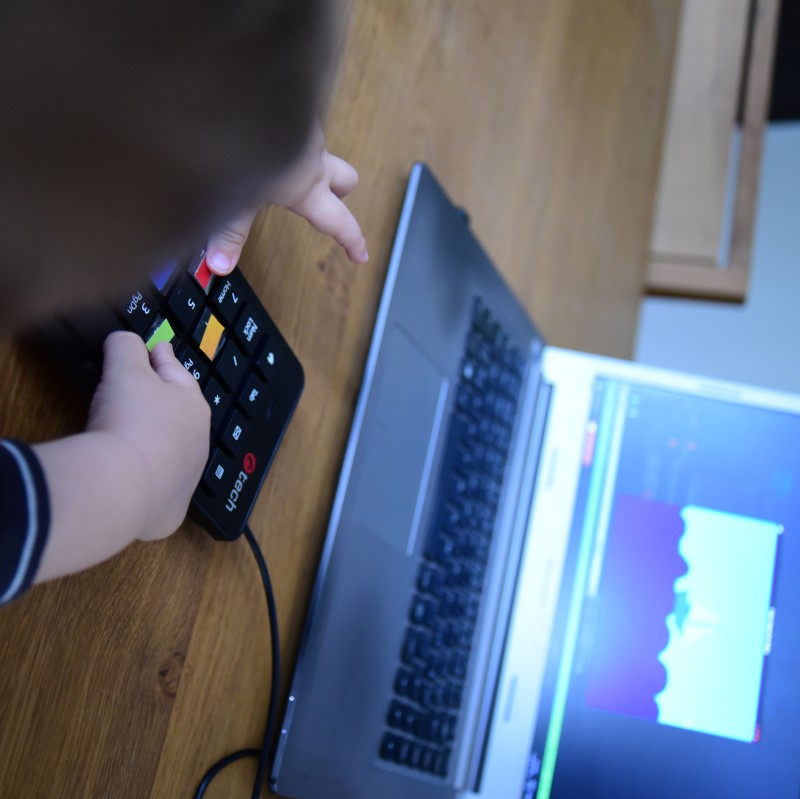

# Color game for Oskar

He wants to play with the computer so I thought he'd better play some good game
of colors. It is still work-in-progress, but already playable.

You can easily change the pictures, add more pictures, add more colors. The
whole thing is about a hundred lines of readable lisp - all on one file
`main.lisp`.

It sure can be compiled to binary and what not. But the easiest way is to just
cat it to lisp interpreter/compiler. And of course to have the libraries used - you need:
* a lisp (sbcl in example underneath)
* quicklisp
* sdl2
* sdl2-mixer


For debian based linux it would be something like:

```
$ sudo apt-get install sbcl libsdl2 libsdl2-mixer cl-quicklisp
$ curl -O https://beta.quicklisp.org/quicklisp.lisp
$ sbcl --load quicklisp.lisp
* (quicklisp-quickstart:install)
* (ql:add-to-init-file)
* (quit)
$ cat main.lisp | sbcl
```

than tape colors over numerical keyboard and have fun:

